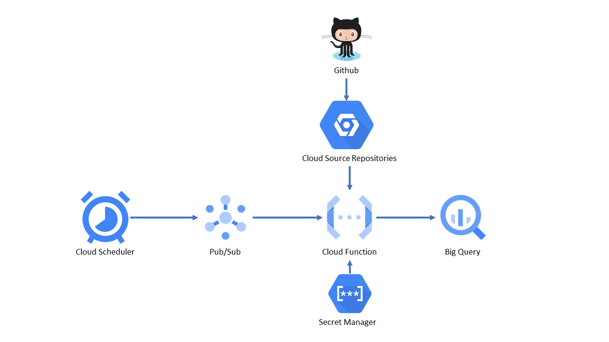

# Energie Fitness Gym Tracker
A webscraping Python script for extracting the number of members in the venue.

## Hosting on GCP
To ensure consistent scraping at regular intervals, GCP can be used for a serverless service.

### Google Cloud Function
The "gcp" branch of this repo can be mirrored on to Google Source   Repositories and fed to a Google Cloud Function.
The script **must** be named "main.py".

The function script will export data to a table in **Big Query** and will be triggered by **Cloud Pub/Sub**.

### Google Cloud Scheduler
The cloud function can be set up to run on 15 minute intervals from 6am-11pm using the CRON */15 6-23 * * *
The Cloud Scheduler triggers a **Cloud Pub/Sub** topic that triggers the Google Cloud Function.

### Other used GCP services:
* Secret Manager
* Cloud Source Repositories

